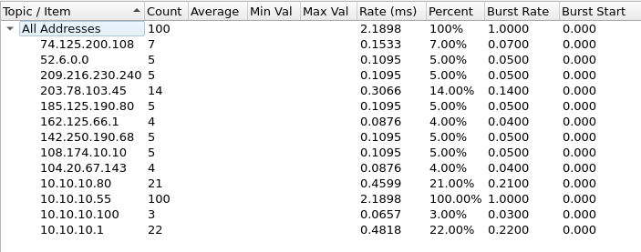

# 🌐 Network Traffic Forensics: Cyber Attack Investigation via Packet Analysis

### 🔬 Case Study: Infected Endpoint Detection & Core .pcap Analysis

---

## 📌 Project Context & Disclaimer
> **⚠️ Educational Lab Scenario:** > This investigation was conducted using raw network traffic logs (`.pcap`) from the **Linuxenic Corp** platform. This project demonstrates a SOC analyst’s ability to perform *network forensics*, conduct in-depth packet analysis (*Deep Packet Inspection*), map the timeline of an infection, and identify indicators of compromise (IoC) directly from network cables using **Wireshark**.

---

## 📖 Incident Scenario & Threat Hypothesis
The SOC team reports that an employee’s workstation has been compromised. The team has captured network traffic in `data-leak.pcap`. Further analysis is needed to dig deeper for information. The tool used is Wireshark.

## Investigation
* **Identify the IP addresses of employee workstations**
  

  From the list of IP addresses, it appears that `10.10.10.55` generated the most traffic. That IP address belongs to the workstation of an employee whose system was compromised.

---

## 🏗️ Metodologi & Alur Investigasi Network Forensics
