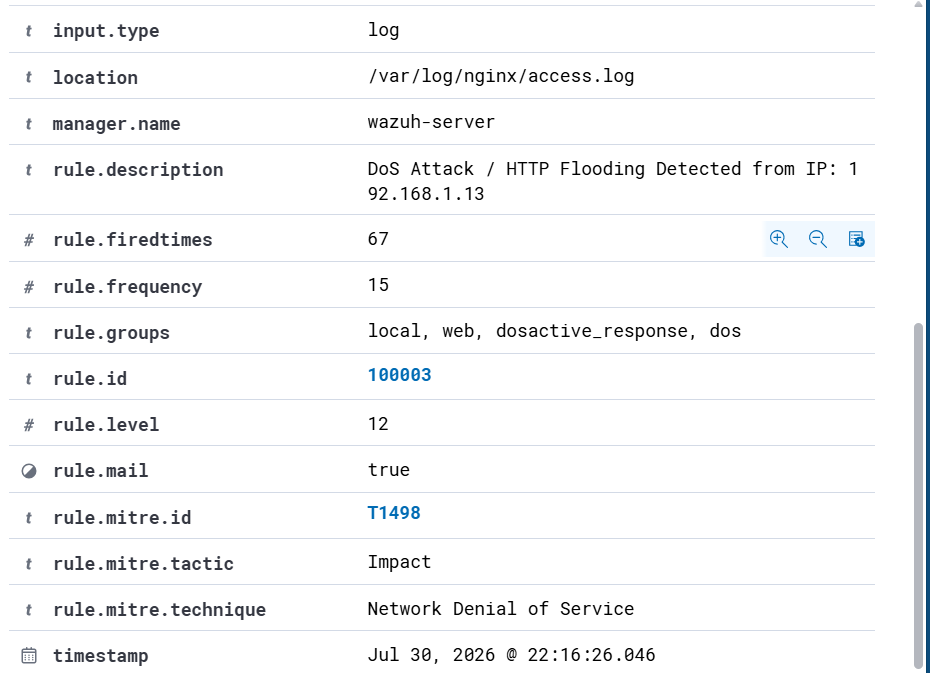
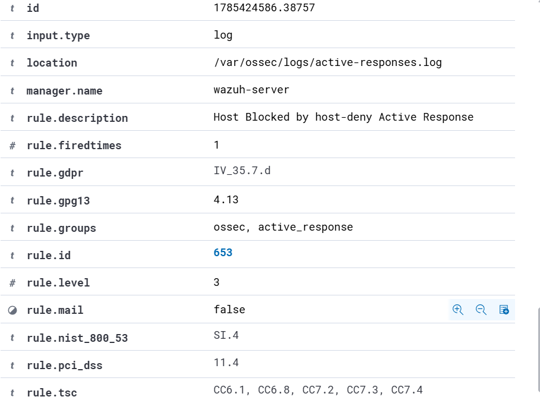
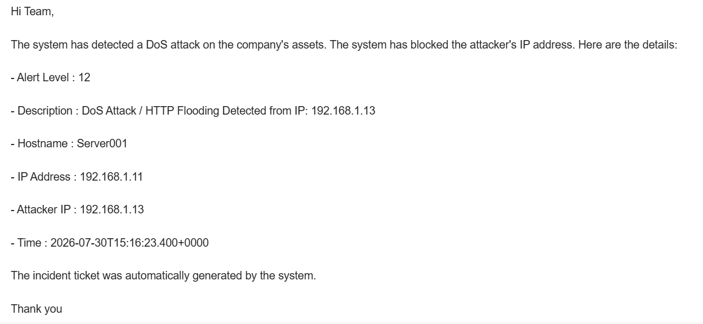
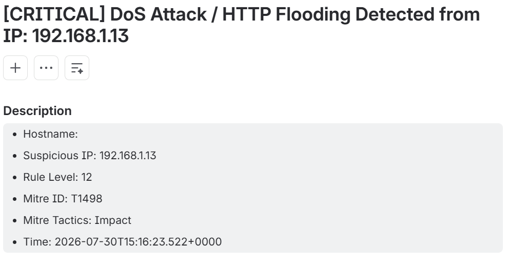

## DoS/DDoS ATTACK AUTOMATION RESPONSE

## Project Overview

Automate the blocking of attacker IP addresses when assets are subjected to a DoS/DDoS attack and automatically create incident tickets.

## Workflow Diagram

## Scenario

The SOC analyst received an email notification that a DDoS attack had been launched against the server. The SOAR system automatically blocked the attacker's IP address.

## Chronology

- Wazuh detected a DoS/DDoS attack on target server001 
  

  Detail information:
  * Attacker IP : `192.168.1.13`
  * Level : 12
  * Time : 22:16
  * Mitre ID : T1498
- The attacker's IP address was automatically blocked by the system
  
  
- SOC analyst received an email for notification alert
  
  
- An incident ticket is automatically created for follow-up by the team
  
