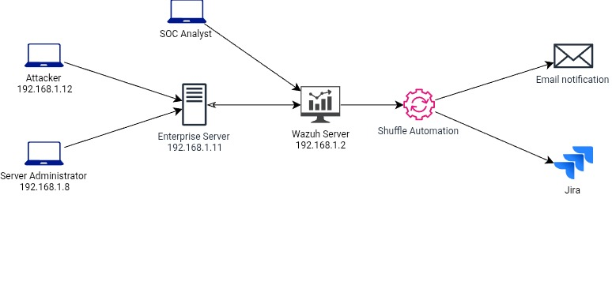

## PROJECT OVERVIEW

Monitoring endpoints (company servers) and automatically responding to attacks. This project is divided into separate cases. The following is an overview of the automation lab

**SOC Automation Lab Environment**
- Wazuh server (192.168.1.2)
- Enterprise server (192.168.1.11)
- Administrator server (192.168.1.8)
- Attacker (192.168.1.12)
- Shuffle automation tools
- Email
- Jira management system
