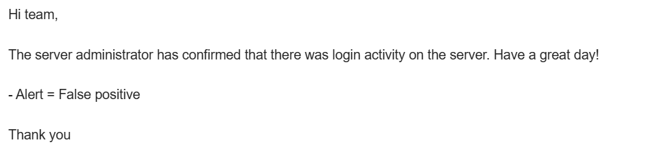
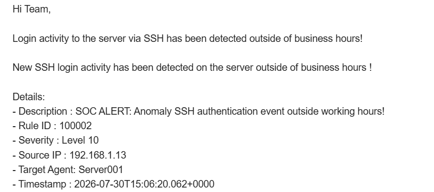
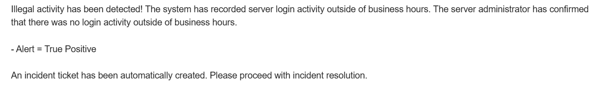

## SUSPICIOUS LOGIN - AUTOMATION RESPONSE
image

## Project Overview

Automatically detects suspicious login activity with Wazuh alerts. Shuffle is used to automate the attack response process.

## Workflow Diagram

## Scenario

The server administrator and SOC analyst receive an email notification that there was login activity on the server outside of business hours. The server administrator can confirm whether the login actually occurred. If so, the SOC analyst will receive an email notification that the activity was legitimate. If not, the SOC analyst will receive an email notification that the activity was illegitimate, and the system will automatically create an incident ticket.

## Normal Activity in Outside of Businness Hours

1. Wazuh received an alert that there was suspicious login activity outside of business hours
2. The SOC analyst received an email reporting suspicious activity—specifically, a login to the server outside of business hours
   

   A suspicious IP address, `192.168.1.8`, was detected attempting to log in to the company's server outside of business hours at 13:50 UTC / 21:00 GMT+7. 
3. The server administrator received an email alerting them to suspicious login activity and was asked to immediately confirm whether there had indeed been any login activity at that time. The SOC analyst received an email stating that the activity was legitimate and had been confirmed by the server administrator 
    

## Suspicious Activity in Outside of Businness Hours

1. Wazuh received an alert that there was suspicious login activity outside of business hours
2. The SOC analyst received an email reporting suspicious activity—specifically, a login to the server outside of business hours
   

   A suspicious IP address, `192.168.1.13`, was detected attempting to log in to the company's server outside of business hours at 15:06 UTC / 22:06 GMT+7.
3. The server administrator has confirmed that they did not log in to the server at that time.
4. The SOC analyst received an email stating that the activity did not originate from the server administrator (was unauthorized). An incident ticket was then automatically created
   

## INCIDENT REPORT

**1. Incident Summary**

| Parameter | Data |
| --- | --- |
| Incident Status | Closed |
| Attack Category | Detect logins to company assets outside of business hours |
| Affected Assets | Server001 `192.168.1.11` |
| Entry Points | Port 22 - SSH client |

**2. Chronological**
- An unknown IP address `192.168.1.13` especially logged into the server via an SSH client outside of business hours
- The server administrator confirmed that there were no login attempts to the server from other devices
- The SOC analyst received an email stating that this was a valid instance of suspicious activity
- Incident tickets are created automatically

   
