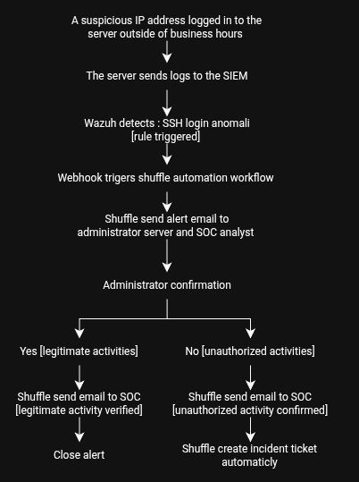
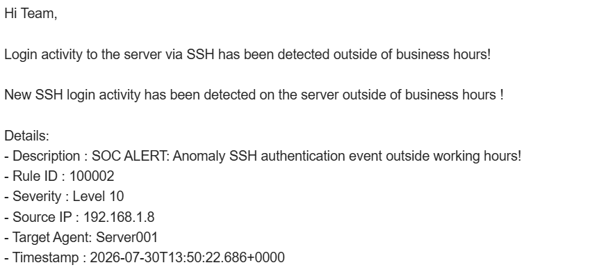

## SUSPICIOUS LOGIN - AUTOMATION RESPONSE
image

## Project Overview

Automatically detects suspicious login activity with Wazuh alerts. Shuffle is used to automate the attack response process.

## Workflow Diagram

## Scenario

The server administrator and SOC analyst receive an email notification that there was login activity on the server outside of business hours. The server administrator can confirm whether the login actually occurred. If so, the SOC analyst will receive an email notification that the activity was legitimate. If not, the SOC analyst will receive an email notification that the activity was illegitimate, and the system will automatically create an incident ticket.

## Step

1. Wazuh received an alert that there was suspicious login activity outside of business hours
2. The SOC analyst received an email reporting suspicious activity—specifically, a login to the server outside of business hours
   
4. The server administrator received an email alerting them to suspicious login activity and was asked to immediately confirm whether there had indeed been any login activity at that time.
5. 
