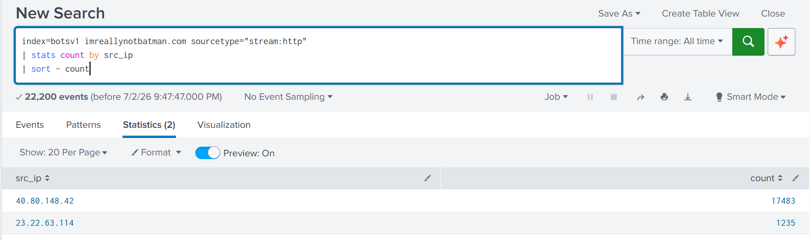
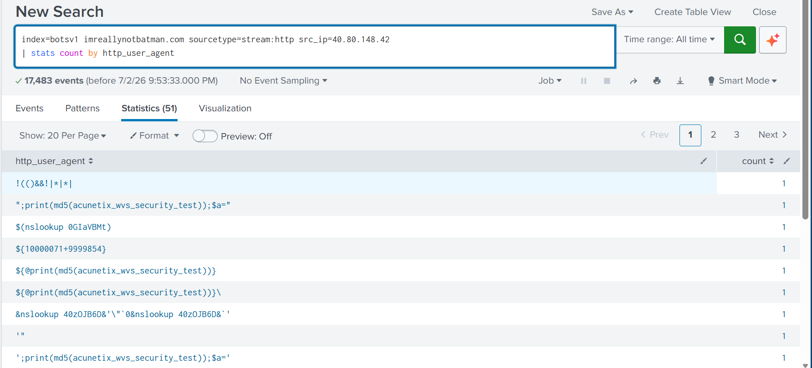

## Enterprise Threat Hunting & Incident Lifecycle Using SPLUNK ##


---
> This project using Botsv1 dataset from SPLUNK
---

## Scenario : Wayne Enterprise Attack
An attacker successfully defaced the website `http://imreallynotbatman.com`

## Cyber Kill Chain ##
Use a cyber kill chain model to map out the stages an attacker goes through.

**Reconnaissance phase**
 * **Investigation**
   Identificate IP address from http trafic
   
```
   IP address:
   `40.80.148.42`, `23.22.63.114`
```

   The IP address with the highest count is the one performing reconnaissance (scanning).

   

```
   Reconnaissance tools : acunetic_wvs_security_test
```

   **Acunetic web scanner** keeps appearing, this indicates that an attacker is using this tool for reconnaissance

   ```
   Information Obtained
   * `40.80.148.42`, `23.22.63.114` send requests to server
   * `40.80.148.42` is scanning `192.168.250.70
   * Attacker use acunetic web scanning
   ```
   
   ## Investigate Exploitation ##

   **Find IP server (destination)**
   
   ```
   IP server : 192.168.250.70
   ```
   `192.168.250.70` 
