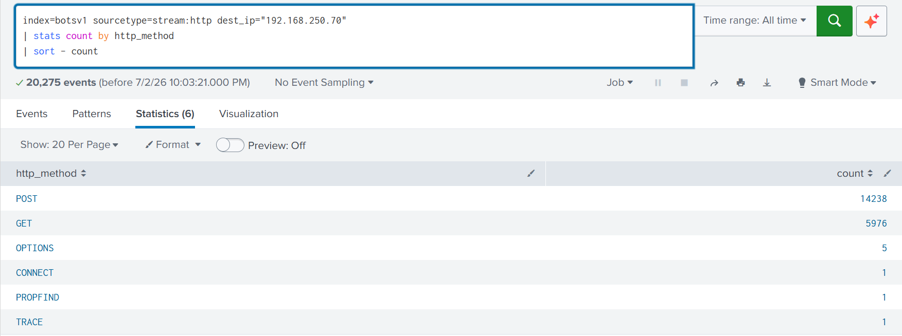
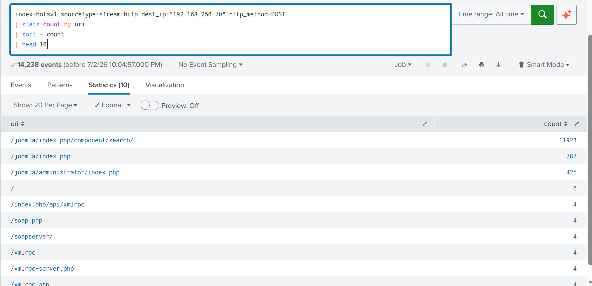
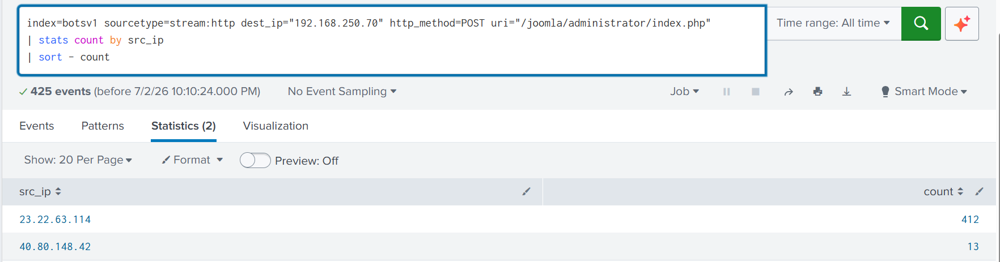
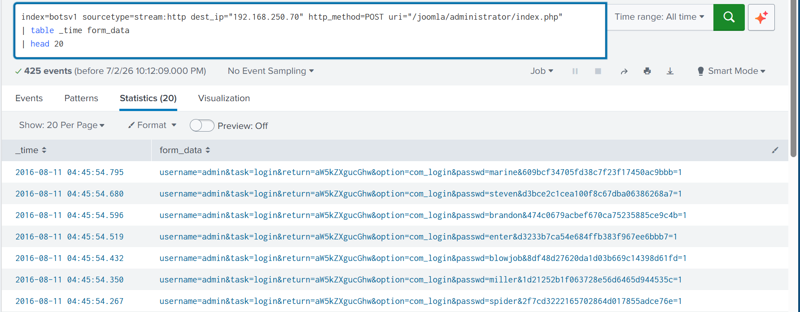
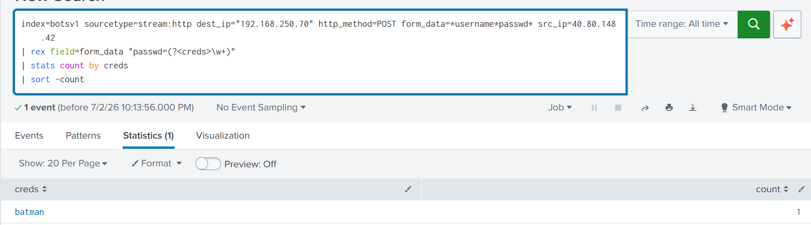
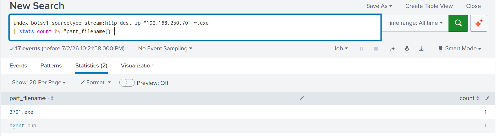
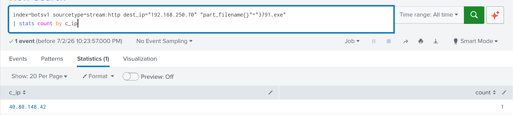
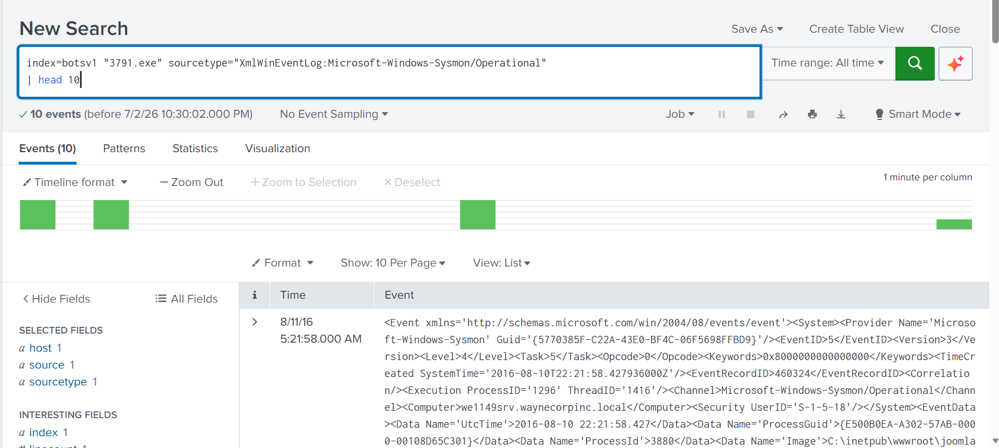

## Enterprise Threat Hunting & Incident Lifecycle Using SPLUNK ##


---
> This project using Botsv1 dataset from SPLUNK
---

## Scenario : Wayne Enterprise Attack
An attacker successfully defaced the website `http://imreallynotbatman.com`

## Cyber Kill Chain ##
Use a cyber kill chain model to map out the stages an attacker goes through.

**Reconnaissance phase**
 * **Investigation**
   Identificate IP address from http trafic
   
```
   IP address:
   `40.80.148.42`, `23.22.63.114`
```

   The IP address with the highest count is the one performing reconnaissance (scanning).

   

```
   Reconnaissance tools : acunetic_wvs_security_test
```

   **Acunetic web scanner** keeps appearing, this indicates that an attacker is using this tool for reconnaissance

   
   **Information Obtained:**
   * `40.80.148.42`, `23.22.63.114` send requests to server
   * `40.80.148.42` is scanning `192.168.250.70
   * Attacker use acunetic web scanning

   
   ## Investigate Exploitation Phase##

   **Find IP server (destination)**
   
   ```
   IP server : 192.168.250.70
   ```
   `192.168.250.70` 

   **Check HTTP Request to Web Server**
   

   POST is the most common request, it could be due to login attempts or form submissions.

   **URI That Are frequently POST**
   

   
   Top 3 URI
   * `/joomla/index.php/component/search/`
   * `/joomla/index.php/`
   * `/joomla/administrator/index.php`

   `/joomla/administrator/index.php` is the URL most likely to be attacked because it leads directly to the administrator

   **Identify the IP address that posted to the URI**
   

  The IP address that sent the request to the server was identified as: `23.22.63.114` 

  **Find Credentials Attemts in Form_data**
  

  The attacker is attempting to use a brute-force attack on credentials to gain access to the admin page

  **Information obtained:**
  * Web server destination IP : `192.168.250.70`
  * The HTTP method with the highest count : POST
  * The most frequently POSTed URIs : `/joomla/administrator.index.php/`
  * The IP addresses that have sent the most POST requests to the login page : `23.22.63.114`
  * Methods used by attackers to obtain credentials : Brute force
  * Usernames attempted by the attacker : admin

## Investigate Installation Phase ##

**Find Uploaded Files (executable file)**


File found : 3791.exe

**Find IP Address That Uploaded The File**


**Information Obtained:**
* Uploaded file : 3791.exe
* IP that uploaded file : 40.80.148.42

## Investigate Defacement

**Check Outbond Traffic From Web Server**


**Check the URL accessed by the attacker's IP address**


**Get Detailed Defacement File**


**Information Obtained:**
* The destination IP address accessed by the web server (C2) : `23.22.63.114`
* Downloaded file (file defacement): `/poisonivy-is-coming-for-you-batman.jpeg`
* Hostname of the downloaded file : `prankglassinebracket.jumpingcrab.com`


