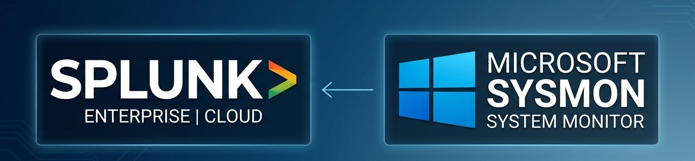

## Enterprise Threat Monitoring with Splunk SIEM and Sysmon ##

## Project Overview
Monitor and detect suspicious activity using Splunk Enterprise integrated with Sysmon. Monitoring and detection operations use the Splunk dashboard.

## Project Environment
* Splunk Enterprise Server
* PC Desktop - Windows 10
* Attacker - Kali Linux

## Monitoring With Splunk Dashboard 
The SOC team detected an alert on the dashboard regarding a malicious application running on an employee’s workstation, followed by an alert regarding data exfiltration

## Cyber Kill Chain Mapping
* **Delivery**
  
  The employee downloaded the file via Google Drive as a .zip archive, extracted it, and then opened it.
  - Raw file : Finance_Report2026.zip
  - Browser : Microsoft Edge.exe
  - Source : Google Drive
  - File extraction : Finance_Report2026.pdf
  - Original file extension : Finance_Report2926.pdf.exe (hidden double extension)
  b
