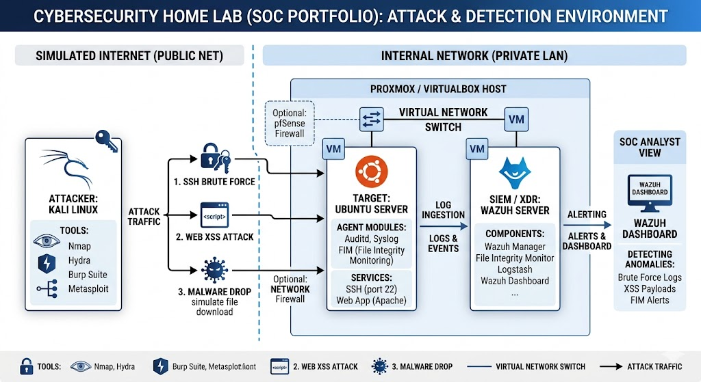

# Technical Walkthrough: SSH Brute Force, XSS Detection & Response

This technical documentation explains the process of simulating a brute force attack, xss attack, and malware distribution on Ubuntu Server's SSH service and how Wazuh SIEM performs detection and log analysis.

## 🗺️ Network Architecture & Simulation Workflow




## 1. Detect Brute Force Attacks
Detected an attack attempt to force entry into the server via **ssh** and detected as **multiple failed login** and **Wazuh** detected it as **brute force attack**

| Timestamp (22 Jun 2026) | Target Agent | Rule Description | Rule Level | Rule ID |
| :--- | :--- | :--- | :---: | :---: |
| 21:55:42.773 - 42.807 | Server01 | sshd: Attempt to login using a non-existent user | 5 | **5710** |
| 21:55:42.807 | Server01 | PAM: Multiple failed logins in a small period of time | 10 | **5551** |

*   **Target IP:** `192.168.56.20` (Ubuntu Server)
*   **Attacker IP:** `192.168.56.10` (Kali Linux)
*   **Perintah Hydra yang dieksekusi:**
```bash
    hydra -l target_user -P /usr/share/wordlists/rockyou.txt ssh://192.168.56.20 -t 4 -V
    ```

## 2. Analisis Log Mentah (Raw Log Analysis)
Sebelum melihat dasbor SIEM, berikut adalah bukti log otentikasi gagal yang terekam secara lokal di target server pada file `/var/log/auth.log`:

```text
# Pasang potongan raw log Anda di sini. Contoh:
Jun 22 20:05:12 ubuntu-server sshd[3142]: Failed password for invalid user admin from 192.168.56.10 port 43210 ssh2
Jun 22 20:05:13 ubuntu-server sshd[3145]: Failed password for invalid user admin from 192.168.56.10 port 43212 ssh2
